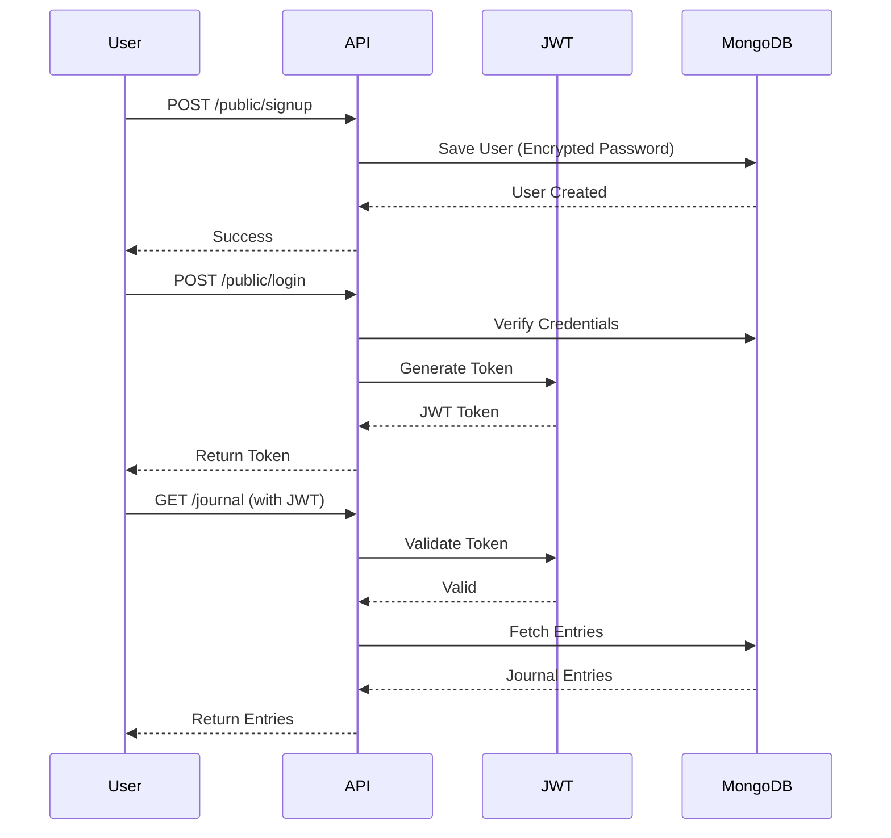

<div align="center">

# 📔 Journal App

### A Secure & Feature-Rich Personal Journal Application

[](https://www.oracle.com/java/)
[](https://spring.io/projects/spring-boot)
[](https://www.mongodb.com/)
[](https://jwt.io/)
[](LICENSE)

A secure, feature-rich journal application built with **Spring Boot** and **MongoDB** that allows users to create, manage, and organize their personal journal entries with **JWT authentication**, **sentiment analysis**, and **weather integration**.

[Features](#-features) • [Tech Stack](#️-technology-stack) • [Installation](#️-installation--setup) • [API Docs](#-api-documentation) • [Contributing](#-contributing)

</div>

---

## ✨ Features

### 🔐 Security & Authentication
- **JWT-based Authentication**: Stateless, secure token-based authentication
- **Role-Based Access Control**: USER and ADMIN roles with different permissions
- **Password Encryption**: BCrypt hashing for secure password storage
- **Unique Username Enforcement**: MongoDB indexing ensures username uniqueness

### 📝 Journal Management
- **CRUD Operations**: Create, Read, Update, and Delete journal entries
- **User-Specific Entries**: Each user can only access their own journal entries
- **Transaction Support**: MongoDB transactions ensure data consistency
- **Sentiment Analysis**: Optional AI-powered sentiment analysis for entries

### 🌐 Additional Features
- **Weather Integration**: Get real-time weather data for any city
- **RESTful API**: Clean, well-structured REST endpoints
- **API Documentation**: Interactive Swagger UI for API exploration
- **Comprehensive Logging**: Built-in logging for debugging and monitoring

---

## 🛠️ Technology Stack

<table>
<tr>
<td>

**Backend**
- ☕ Java 11
- 🍃 Spring Boot 2.7.16
- 🔒 Spring Security
- 🔑 JWT (JJWT 0.12.5)

</td>
<td>

**Database**
- 🍃 MongoDB
- 📊 Spring Data MongoDB
- 🔄 Transaction Support

</td>
<td>

**Tools & Libraries**
- 🔨 Maven
- 📝 Lombok
- 📚 Swagger/OpenAPI 3.0
- ✅ JUnit (Testing)

</td>
</tr>
</table>

---

## 📋 Prerequisites

Before you begin, ensure you have the following installed:

| Requirement | Version | Download Link |
|------------|---------|---------------|
| ☕ **Java JDK** | 11 or higher | [Oracle JDK](https://www.oracle.com/java/technologies/downloads/) |
| 🍃 **MongoDB** | 4.0+ | [MongoDB Download](https://www.mongodb.com/try/download/community) |
| 🔨 **Maven** | 3.6+ | [Maven Download](https://maven.apache.org/download.cgi) |
| 💻 **IDE** | Any | [IntelliJ IDEA](https://www.jetbrains.com/idea/) / [VS Code](https://code.visualstudio.com/) |

---

## ⚙️ Installation & Setup

### 1️⃣ Clone the Repository

```bash
git clone https://github.com/Himanshu0508Raturi/journalApp.git
cd journalApp/journalApp
```

### 2️⃣ Configure MongoDB

#### Option A: Local MongoDB

Create `src/main/resources/application.properties`:

```properties
# MongoDB Configuration
spring.data.mongodb.uri=mongodb://localhost:27017/journalApp
spring.data.mongodb.database=journalApp

# JWT Configuration
jwt.secret=your-secret-key-here-make-it-long-and-secure
jwt.expiration=86400000

# Logging
logging.level.net.engineeringdigest. journalApp=DEBUG
```

#### Option B: MongoDB Atlas (Cloud)

```properties
spring.data.mongodb.uri=mongodb+srv://<username>:<password>@cluster.mongodb.net/journalApp? retryWrites=true&w=majority
```

### 3️⃣ Build the Project

```bash
./mvnw clean install
```

Or on Windows:

```bash
mvnw. cmd clean install
```

### 4️⃣ Run the Application

```bash
./mvnw spring-boot:run
```

The application will start on **`http://localhost:8080`** 🚀

---

## 📚 API Documentation

### 🌐 Swagger UI

Once the application is running, explore the interactive API documentation: 

```
http://localhost:8080/swagger-ui.html
```

### 📍 API Endpoints

#### 🔓 Public Endpoints (No Authentication Required)

| Method | Endpoint | Description |
|--------|----------|-------------|
| `POST` | `/public/signup` | Register a new user |
| `POST` | `/public/login` | Login and receive JWT token |

**Signup Example:**

```json
POST /public/signup
{
  "userName": "john_doe",
  "password": "SecurePass123!"
}
```

**Login Example:**

```json
POST /public/login
{
  "userName": "john_doe",
  "password": "SecurePass123!"
}

Response:
{
  "token":  "eyJhbGciOiJIUzI1NiIsInR5cCI6IkpXVCJ9..."
}
```

#### 📝 Journal Endpoints (Requires Authentication)

| Method | Endpoint | Description |
|--------|----------|-------------|
| `POST` | `/journal` | Create a new journal entry |
| `GET` | `/journal` | Get all your journal entries |
| `GET` | `/journal/id/{id}` | Get a specific journal entry |
| `PUT` | `/journal/id/{id}` | Update a journal entry |
| `DELETE` | `/journal/id/{id}` | Delete a journal entry |

**Create Journal Entry:**

```json
POST /journal
Headers: Authorization: Bearer <your-jwt-token>

{
  "title": "My First Day",
  "content": "Today was amazing! Started learning Spring Boot."
}
```

#### 👤 User Endpoints (Requires Authentication)

| Method | Endpoint | Description |
|--------|----------|-------------|
| `GET` | `/user` | Get your user information |
| `PUT` | `/user` | Update your profile |
| `DELETE` | `/user` | Delete your account |
| `GET` | `/user/weather/{city}` | Get weather info for a city |

#### 🔧 Admin Endpoints (Requires ADMIN Role)

| Method | Endpoint | Description |
|--------|----------|-------------|
| `GET` | `/admin/all-users` | Get all users |
| `POST` | `/admin/create-admin` | Create admin user |

---

## 🔐 Authentication Flow



---

## 🏗️ Project Structure

```
journalApp/
├── 📁 src/main/java/net/engineeringdigest/journalApp/
│   ├── 📂 controller/           # REST API Controllers
│   │   ├── JournalEntryController.java
│   │   ├── UserController.java
│   │   ├── PublicController.java
│   │   └── AdminController.java
│   ├── 📂 entity/               # MongoDB Entity Models
│   │   ├── JournalEntry.java
│   │   └── User.java
│   ├── 📂 repository/           # MongoDB Repositories
│   │   ├── JournalEntryRepository.java
│   │   └── UserRepository.java
│   ├── 📂 services/             # Business Logic Layer
│   │   ├── JournalEntryService.java
│   │   ├── UserService.java
│   │   └── CustomUserDetailsService.java
│   ├── 📂 config/               # Configuration Classes
│   │   ├── SecurityConfig.java
│   │   └── SwaggerConfig.java
│   ├── 📂 Utilities/            # Utility Classes
│   │   ├── JwtUtil.java
│   │   └── JwtAuthenticationFilter.java
│   └── 📄 JournalApplication.java
├── 📁 src/main/resources/
│   ├── application.properties
│   └── application.yml
├── 📁 src/test/                 # Unit & Integration Tests
│   └── java/
└── 📄 pom.xml                   # Maven Dependencies
```

---

### 🌤️ Weather Integration

Get weather information to add context to your journal: 

```bash
GET /user/weather/London
```

Response: 

```json
{
  "city": "London",
  "temperature": 15.5,
  "condition": "Partly Cloudy",
  "humidity": 65
}
```

### 🔄 Transaction Management

The application uses MongoDB transactions for critical operations:

- ✅ Creating journal entries with user association
- ✅ Deleting journal entries with user reference cleanup
- ✅ User deletion with cascade delete of all entries

**Note**:  Transactions require MongoDB replica sets (available by default with MongoDB Atlas).

---

## 🚀 Deployment

### Docker Deployment

Create `Dockerfile`:

```dockerfile
FROM openjdk:11-jre-slim
WORKDIR /app
COPY target/journalApp-0.0.1-SNAPSHOT. jar app.jar
EXPOSE 8080
ENTRYPOINT ["java", "-jar", "app.jar"]
```

Build and run:

```bash
docker build -t journal-app .
docker run -p 8080:8080 journal-app
```

### Heroku Deployment

```bash
heroku create journal-app-yourname
git push heroku main
heroku config:set MONGODB_URI=your-mongodb-uri
```

---

## 🤝 Contributing

Contributions are welcome! Please follow these steps:

1. **Fork** the repository
2. **Create** a feature branch (`git checkout -b feature/AmazingFeature`)
3. **Commit** your changes (`git commit -m 'Add some AmazingFeature'`)
4. **Push** to the branch (`git push origin feature/AmazingFeature`)
5. **Open** a Pull Request

### Contribution Guidelines

- Follow Java coding conventions
- Write unit tests for new features
- Update documentation as needed
- Keep commits atomic and meaningful

---

## 📝 License

This project is created for **educational purposes**. Feel free to use it as a reference for your own projects! 

---

## 👨‍💻 Author

**Himanshu Raturi**

[](https://www.linkedin.com/in/himanshu-raturi/)
[](https://github.com/Himanshu0508Raturi)

</div>

---

## 🙏 Acknowledgments

- 🍃 **Spring Boot Community** for excellent documentation and support
- 🍃 **MongoDB** for providing a flexible and powerful NoSQL database
- 💡 **Engineering Digest** for project inspiration and guidance
- 🌟 **Open Source Community** for amazing tools and libraries

---

## 📊 Project Stats


---

<div align="center">

### ⭐ Star this repository if you find it helpful!

*This is a learning project demonstrating Spring Boot best practices, security implementation, and MongoDB integration.*

</div>
